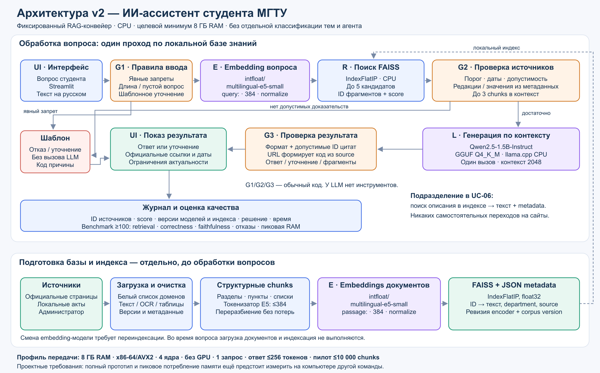

# Архитектура RAG-ассистента, редакция 1.1

**Дата:** 04.10.2026. **Статус:** проектная спецификация лабораторной №1. Выбранные модели ещё не измерялись в составе полного приложения на 8 ГБ RAM.

Редактируемый исходник схемы — `architecture_v2.svg`; проектная конфигурация — `../config/rag_config.json`, ревизии и контрольные суммы моделей — `../config/model_manifest.json`.

## Модели и их роли

| Роль | Выбранная модель | Представление и параметры |
|---|---|---|
| Embeddings документов и вопроса | `intfloat/multilingual-e5-small` | 384 измерения, mean pooling и L2-нормализация, CPU; `passage: ` для документа, `query: ` для вопроса |
| Генерация по найденному контексту | `Qwen/Qwen2.5-1.5B-Instruct-GGUF` | Файл `qwen2.5-1.5b-instruct-q4_k_m.gguf`, семейство 2.5, 1.5B Instruct, Q4_K_M; локальный llama.cpp на CPU |
| Подготовка текущей редакции документации | OpenAI `gpt-6.1-sol` | Версия 6.1; инструмент Codex. Эта модель не входит в обязательный локальный прототип |

E5 выбран для многоязычного поиска, включающего русский язык, и небольшого векторного представления. Его размерность и предел 512 позиций указаны в [конфигурации модели](https://huggingface.co/intfloat/multilingual-e5-small/blob/main/config.json); правила префиксов и нормализации — в [карточке разработчика](https://huggingface.co/intfloat/multilingual-e5-small). Качество на университетских вопросах предстоит подтвердить собственным экспериментом.

Qwen выбран как компактная instruct-модель с поддержкой русского языка; квантованная версия доступна у самого разработчика и не требует облачного API. Свойства модели подтверждены [карточкой Qwen](https://huggingface.co/Qwen/Qwen2.5-1.5B-Instruct-GGUF). Малый размер не гарантирует правильность интерпретации сложных норм: обязательны ограничение контекстом, источники и оценка качества.

Фиксируются ревизии репозиториев, а не изменяемая ссылка `main`. `model_manifest.json` содержит идентификаторы и SHA-256 весов, полученные из метаданных официальных репозиториев. Веса не включены в архив документации и не скачивались для измерения качества на этом этапе.

## Обработка вопроса

1. **UI:** Streamlit получает текст вопроса.
2. **G1:** обычный код проверяет пустоту/длину, явно запрещённые персональные запросы и действия во внешних системах. Для известного недостающего параметра возможен шаблон уточнения. Это ограниченный набор правил, без отдельной модели классификации темы.
3. **E:** весь допустимый вопрос кодируется E5 с префиксом `query: `.
4. **R:** нормализованный вектор используется для поиска в локальном FAISS `IndexFlatIP`. Скалярное произведение нормализованных векторов соответствует cosine similarity. Получается до 5 кандидатов с ID и score.
5. **G2:** код проверяет score, действие источника, допустимое применение, нужный уровень образования и известные конфликты метаданных. Порог настраивается на validation-наборе, сейчас он не выдуман: `min_similarity=null` означает необходимость калибровки. К генератору передаётся до 3 допустимых фрагментов, которые помещаются в общий бюджет контекста. Нет доказательств — шаблон отказа, без вызова LLM.
6. **L:** Qwen вызывается один раз. Она получает вопрос, системную инструкцию и найденные chunks с ID, возвращает структурированный результат `answer` либо `clarify`, текст и список ID цитат. Она не имеет tools, доступа к браузеру или личному кабинету.
7. **G3:** код проверяет формат результата и принадлежность ID к переданному контексту. URL формируются по метаданным, а не по свободному тексту модели. При ошибке показываются найденные фрагменты без генерации. Проверка ID не доказывает, что каждое утверждение соответствует источнику; для этого используется faithfulness-оценка.
8. **UI и журнал:** отображаются ответ/уточнение/отказ, источники и даты; сохраняются версия индекса, ID, score, решение и время без личных данных.

Уточнение — новый вопрос пользователя и новый проход того же конвейера. Оно не запускает автономный цикл планирования или вызовов инструментов.

## Как реализуется поиск подразделения в UC-06

В базу заранее добавляются официальные описания подразделений с названием, компетенцией, URL и допустимыми контактами. E5 сопоставляет формулировку вопроса с этими описаниями; FAISS возвращает фрагменты; G2 проверяет их пригодность. Название подразделения и адрес страницы берутся из найденного документа. Qwen кратко излагает найденные сведения.

Таким образом, фраза «система находит подразделение» означает retrieval по справочнику. Предварительная классификация темы, самостоятельный поиск сайта и агент для этого сценария отсутствуют. Если справочник не содержит ответа, следует отказ или уточнение.

## Подготовка индекса

Администратор отдельно загружает разрешённые документы, очищает их, сохраняет версии и метаданные. Затем структурные chunks проверяются токенизатором E5: вход вместе с префиксом, заголовком и служебными токенами должен помещаться в 384 токена — проектный предел ниже максимума модели. Превышение приводит к повторному структурному разбиению с перекрытием до 48 токенов, а не к молчаливому обрезанию.

Для фрагментов из работы №2, заданных в словах, такая проверка обязательна перед embedding-индексацией. Число слов нельзя приравнивать к числу токенов.

После mean pooling и L2-нормализации 384-мерные float32-векторы записываются в FAISS. Отдельно хранится отображение ID → текст/метаданные. Ревизия encoder, правила кодирования и версия корпуса становятся частью версии индекса. Смена embedding-модели требует переиндексации.

## Требования к памяти и передаче другой команде

Целевой минимум: **8 ГБ RAM**, CPU x86-64 с AVX2 и четырьмя ядрами, Windows 10/11 x64 или Linux x64. Дискретная видеокарта не нужна. Профиль ограничен одним запросом одновременно, контекстом Qwen 2048 токена и максимумом 256 токенов ответа. Фрагменты упаковываются с учётом именно токенизатора Qwen, включая промпт и резерв для ответа; `top-3` — верхний предел, а не обязательное число.

Согласно метаданным официальных репозиториев, выбранный GGUF занимает 1 117 320 736 байт, а `model.safetensors` E5 — 470 641 600 байт. Файл Qwen подтверждён [официальной страницей файла](https://huggingface.co/Qwen/Qwen2.5-1.5B-Instruct-GGUF/blob/91cad51170dc346986eccefdc2dd33a9da36ead9/qwen2.5-1.5b-instruct-q4_k_m.gguf). Размер файла не равен пику RAM: дополнительно нужны рантайм, KV-cache, буферы, Python, индекс и метаданные.

Для 10 000 векторов размер массива float32 составляет `10 000 × 384 × 4 = 15 360 000 байт`, около 14,65 МиБ, без метаданных и накладных расходов FAISS. Целевой суммарный пик рабочих процессов — до 4 ГиБ. Это оценочный бюджет и критерий приёмки, не заявленный результат замера.

Индексация выполняется отдельно от обслуживания вопросов, batch size документов — до 8, запросов — 1; модели загружаются один раз. При реализации другой команде передаются зафиксированные версии библиотек и CPU-сборки llama.cpp, модели/хеши, конфигурация, команда запуска и результаты измерений на целевой машине. На этапе лабораторной №1 зафиксирован выбор; приложение не выдаётся за уже развёрнутое.

## Границы правил

G1 не гарантирует распознавание всех опасных перефразировок. G2 выявляет конфликты редакций и явно структурированных значений, но не все произвольные текстовые противоречия. G3 проверяет формат и происхождение ссылок, но не все смыслы утверждений. Поэтому качество проверяется отдельным benchmark, а источник остаётся приоритетнее ответа модели.

Обязательные компоненты — E5, FAISS, Qwen, программные проверки и интерфейс. Агент, модель классификации тем, cross-encoder reranker и GPU не входят в базовый профиль.
